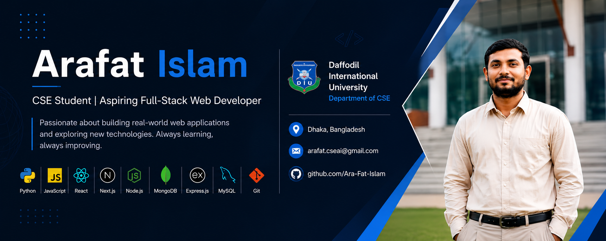

  

<h1 align="center">Arafat Islam</h1>

<h3 align="center">
Computer Science & Engineering Student | Aspiring Full-Stack Web Developer
</h3>

  
  
  

  

---

## 👨‍💻 About Me

I'm a Computer Science & Engineering student at **Daffodil International University**, passionate about **Software Engineering and Full-Stack Web Development**.

I enjoy building practical applications, solving programming problems, and learning modern technologies. I am continuously improving my development skills while strengthening my Computer Science fundamentals.

### 🔭 Currently Working On

- 🌐 Exploring **Full-Stack Web Development**
- 🐍 Learning and building applications with **Python & Django**
- ⚛️ Exploring **React.js & Next.js**
- 🧠 Strengthening **Data Structures & Algorithms**
- 🗄️ Improving my **Database & Backend Development** skills
- 🤝 Contributing to collaborative academic and software projects

---

## 🛠️ Skills & Technologies

### 💻 Programming Languages

  

### 🌐 Frontend Development

  

### ⚙️ Backend Development

  

### 🗄️ Database

  

### 🔧 Tools & Platforms

  

---

## 🚀 Projects & Contributions

### 🛒 NexShop-BD
**E-Commerce Management System | Team Project**

A Django-based e-commerce management system developed as a collaborative academic project. The system includes product management, product search and filtering, shopping cart, checkout, and order management.

**My Role:** Contributed as a team member to the project development.

**Technology:** Python • Django • MySQL • HTML • CSS • JavaScript

---

### 📝 Markdown-to-HTML Compiler & Web Studio
**Compiler Design Project | Team Project**

A collaborative compiler project that converts Markdown documents into HTML using parsing, Abstract Syntax Tree (AST), symbol table, semantic validation, and HTML generation.

**My Role:** Contributed as a team member to the compiler and web studio implementation.

**Technology:** C • Flex • Bison • AST • Symbol Table • HTML • CSS • JavaScript

---

## 🎯 Current Focus

  

- Full-Stack Web Development
- Backend & Database Engineering
- Data Structures & Algorithms
- Software Engineering
- Data Science & Machine Learning

---

## 📊 GitHub Statistics

  

  

  

---

## 🌐 Connect With Me

---

## 📍 Location & Education

  📍 <strong>Dhaka, Bangladesh</strong>
  &nbsp;&nbsp; • &nbsp;&nbsp;
  🎓 <strong>Daffodil International University</strong>
  &nbsp;&nbsp; • &nbsp;&nbsp;
  💻 <strong>Department of Computer Science & Engineering</strong>

---

  <i>Code. Learn. Build. Grow.</i> 🚀

